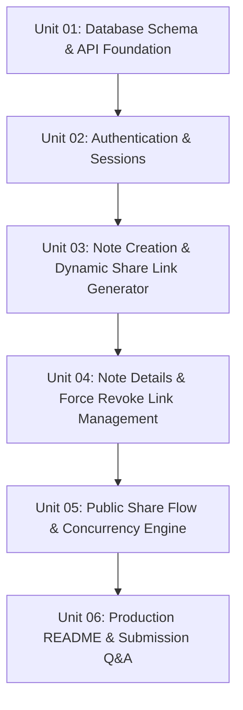

# Master Build Plan — Secure Note-Taking Application

This build plan breaks down the development of the Secure Note-Taking App into 6 ordered, spec-driven units. Each unit produces a concrete, verifiable feature set.

---

## Build Plan Sequence

---

## Unit Breakdown

### Unit 01: Database Schema & API Foundation
- **Spec**: `context/Feature/01-database-and-api-foundation.md`
- **Output**: Relational Prisma schema (`User`, `Note`, `ShareLink`), database connection pool setup, initial seed script, and Hono.js API server configuration.

### Unit 02: Authentication & Sessions (`/login`, `/register`)
- **Spec**: `context/Feature/02-auth-pages-and-session.md`
- **Output**: `/login` and `/register` pages, JWT authentication, `bcryptjs` password hashing, HTTP-Only session cookies, and route guard middleware.

### Unit 03: Note Creation & Dynamic Share Link Generator (`/notes/new`)
- **Spec**: `context/Feature/03-note-creation-and-link-generator.md`
- **Output**: Note creation form (`/notes/new`), title/content fields, Expiry Date-Time picker, Share Type toggle (`ONE_TIME` / `TIME_BASED`), Access Type toggle (`PUBLIC` / `PROTECTED`), and Dynamic Password Generator.

### Unit 04: Note Details & Force Revoke Link Management (`/notes/[id]`)
- **Spec**: `context/Feature/04-note-details-and-link-management.md`
- **Output**: Note detail view page (`/notes/[id]`), active share links table, view count analytics badge, and **Force Invalidate / Revoke** action button.

### Unit 05: Public Share Flow & Concurrency Engine (`/share/[token]`)
- **Spec**: `context/Feature/05-public-share-flow-and-concurrency.md`
- **Output**: Public unlock page (`/share/[token]`), password prompt modal, atomic SQL query for race-condition safe one-time link consumption, and edge-case status banners (Expired, Used, Revoked, Invalid, Wrong Password).

### Unit 06: Production README & Submission Q&A
- **Spec**: `context/Feature/06-poc-documentation-and-submission.md`
- **Output**: Comprehensive submission README with setup instructions, schema diagrams, technical Q&A answers (race conditions, 1M users scaling, brute-force defense), test credentials, and email submission template.
